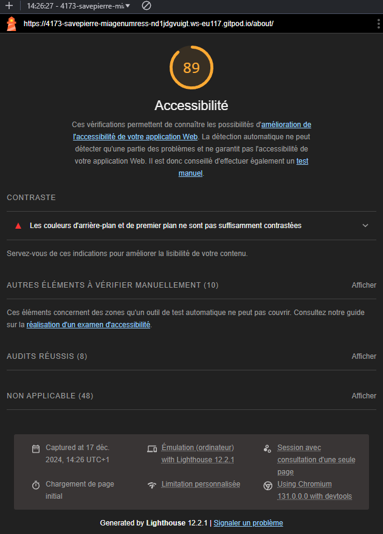

# Q1 : Donner la tailles des fichiers générer par la commande.
Réponse:

Initial chunk files | Names         |  Raw size |
polyfills.js        | polyfills     |  90.20 kB | 
main.js             | main          |  18.18 kB | 
styles.css          | styles        |  95 bytes | 

# Q2 : Donner la tailles des fichiers générer par la commande.
Réponse:

Initial chunk files   | Names         |  Raw size | Estimated transfer size
main-FT3QBEBB.js      | main          | 208.48 kB |                56.93 kB
polyfills-FFHMD2TL.js | polyfills     |  34.52 kB |                11.28 kB
styles-5INURTSO.css   | styles        |   0 bytes |                 0 bytes

# Q3 : Est-ce que le fichier est lisible ? Quel est l'intêret de minifier les fichiers d'un point de vue éco-responsable ? Pourquoi on ne minifie pas les fichiers générer en mode dev ?
Réponse:

Le fichier n'est pas facilement lisible. La minification supprime les espaces, les commentaires et raccourcit les noms de variables, rendant le code compact et difficile à interpréter.

La minification réduit la taille des fichiers, diminuant la bande passante utilisée et la consommation d’énergie des serveurs et terminaux.
Cela améliore la rapidité de chargement tout en réduisant l’empreinte carbone liée au transfert de données.

En mode développement, la lisibilité du code est importante pour faciliter les modifications et le débogage.
La minification complique ces tâches et ralentit le processus, ce qui est inutile pendant les phases de test.

# Q4 : Donner la tailles des fichiers générer par la commande.
Réponse:

dist/index.html                   0.46 kB │ gzip:  0.30 kB
dist/assets/react-CHdo91hT.svg    4.13 kB │ gzip:  2.05 kB
dist/assets/index-DZl-RcEH.css    5.66 kB │ gzip:  1.40 kB
dist/assets/index-C_arIFqf.js   143.90 kB │ gzip: 46.34 kB

# Q5: Quel est l'intérêt du HMR ?
Réponse:

Le HMR permet de mettre à jour des modules (fichiers JavaScript, CSS, etc.) dans une application en cours d'exécution sans recharger entièrement la page

# Q6: Donner la tailles des fichiers générer par la commande. Pourquoi il faut être vigilant sur les libraires et autre composant qu'on ajoute dans nos applications d'un point de vue éco-responsable ?
Réponse:

dist/index.html                   0.46 kB │ gzip:  0.30 kB
dist/assets/react-CHdo91hT.svg    4.13 kB │ gzip:  2.05 kB
dist/assets/index-DZl-RcEH.css    5.66 kB │ gzip:  1.40 kB
dist/assets/index-03z4V8OH.js   156.75 kB │ gzip: 51.85 kB

Ajouter trop de librairies ou composants alourdit les applications, ce qui augmente la consommation de bande passante et d'énergie. Cela ralentit les performances et sollicite davantage les serveurs et appareils des utilisateurs. De plus, certaines librairies contiennent du code inutile qui n'est jamais utilisé. Cela gaspille des ressources

# Q7: Noter les nom des différents fichiers qui ont été générés par la commande.
Réponse:

dist/about/index.html           0.53 kB │ gzip: 0.32 kB
dist/index.html                 0.65 kB │ gzip: 0.37 kB
dist/assets/style-b4SyXn9O.css  2.18 kB │ gzip: 0.79 kB
dist/assets/about-D08RWGIN.js   0.15 kB │ gzip: 0.16 kB
dist/assets/style-Dgd37vtf.js   0.71 kB │ gzip: 0.40 kB
dist/assets/main-BdixoVug.js    3.20 kB │ gzip: 1.14 kB

# Q8 : Noter les nom des différents fichiers .js qui sont chargés au moment du chargement de la page.
Réponse:

Dans "/assets/" :

main-BdixoVug.js
style-Dgd37vtf.js

# Q9 : Noter les nom des différents fichiers .js qui sont chargés au moment du changement de page.
Réponse:

Dans "/assets/" :

about-D08RWGIN.js
style-Dgd37vtf.js

# Q10: Quel est l'intérêt de lu Code Splitting d'un point de vue éco-responsable ?
Réponse:

Le Code Splitting réduit la taille des fichiers téléchargés en ne chargeant que le code nécessaire. Il permet d'éviter de recharger tout le site et cela va permettre de diminuer la consommation de bande passante et d’énergie, tout en accélérant le chargement des applications.
En limitant les ressources utilisées, on améliore les performances et on sollicite moins les serveurs et appareils utilisateur.

ici "style-Dgd37vtf.js" reste le même, donc inutile de le recharger. Donc nous rechargons qu'un seul fichier.

# Q11: Ajouter le screen de votre score :
Screen:

# Q12:  Proposition 1
Description:
Nb de requête total du parcours de l'utilisateur:
Taille total des requêtes du parcours de l'utilisateur:
Taille total des fichiers généré :

# Q13:  Proposition 2
Description:
Nb de requête total du parcours de l'utilisateur:
Taille total des requêtes du parcours de l'utilisateur:
Taille total des fichiers généré :

# Q14:  Proposition 3
Description:
Nb de requête total du parcours de l'utilisateur:
Taille total des requêtes du parcours de l'utilisateur:
Taille total des fichiers générés :